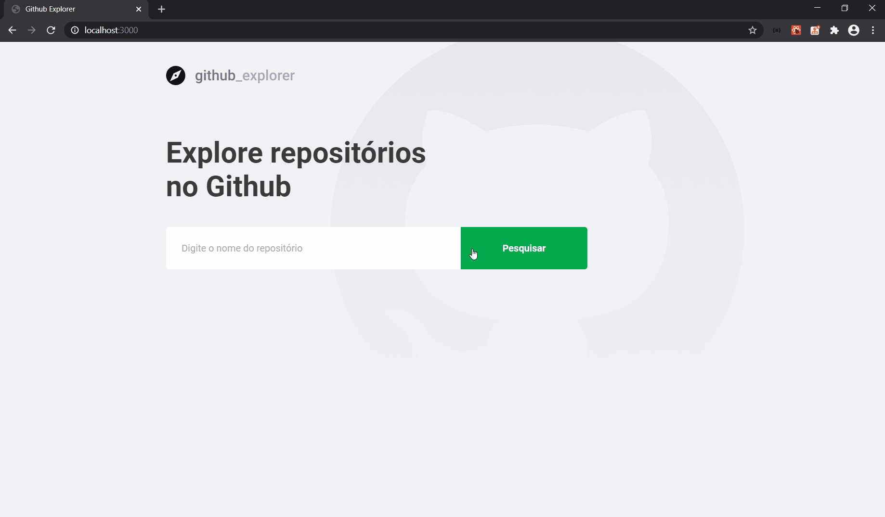

# Github Explorer
A ReactJS app to explore github repositories, it uses github api to gather repositories and some indicators like number of stars, likes and opened issues.

The app is part of Rocketseat bootcamp.

## Main Techs
- Typescript
- Eslint
- Prettier
- Editor Config
- Axios
- Styled Components

## Running
- Install all the dependencies: `yarn`
- Run: `yarn start`
- Buil: `yarn build`

---
Desenvolvido com :purple_heart: por [Marcelo Palmieri](https://www.linkedin.com/in/marcelo-palmieri)
